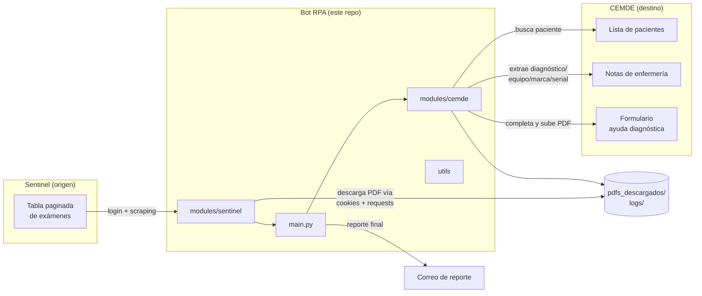

# Arquitectura — Bot RPA Sentinel → CEMDE

## 1. Propósito

Automatización que traslada informes de exámenes cardiológicos confirmados
desde **Sentinel** (sistema donde se generan y confirman los informes) hacia
**CEMDE** (historia clínica del paciente), adjuntándolos como "ayuda
diagnóstica" asociada al paciente, la fecha y el tipo de examen correctos.

Corre de forma desatendida (Windows Task Scheduler, diariamente a las 4 AM),
sin supervisión humana durante la ejecución. Esa característica — nadie mira
la pantalla mientras corre — es la que determina buena parte de las
decisiones de diseño descritas más abajo (circuit breaker, deduplicación,
reporte por correo siempre enviado).

## 2. Vista de sistema



## 3. Flujo de ejecución (`main.py`)

1. `login_sentinel` — autentica en Sentinel.
2. `procesar_tabla_sentinel` — recorre la tabla paginada de exámenes, filtra
   por estado (`CONFIRMADO`, `RECONFIRMADO`, `RECHAZADO`), descarga cada PDF
   nuevo y devuelve una lista de dicts `{ruta, nombre, cedula, examen,
   fecha_atencion, estado, firmante}`.
3. `login_cemde` — autentica en CEMDE.
4. `subir_pdfs` — por cada PDF, abre el paciente en CEMDE y completa el
   formulario de ayuda diagnóstica (o, si el examen está `RECHAZADO`, agrega
   una nota aclaratoria en vez de subir nada).
5. Reporte final — se guarda siempre en `logs/reporte_<timestamp>.txt` y se
   envía **siempre** por correo al terminar (ver §6.4), también si no había
   nada pendiente o si la corrida terminó con un error fatal.

Todo corre en **una sola sesión de Selenium/Edge**, visible y maximizada
(`core/driver.py`), sin headless — así se ejecutó siempre en producción y
cambiarlo no se ha validado.

## 4. Estructura de módulos

| Módulo | Responsabilidad |
|---|---|
| `config/settings.py` | Variables de entorno + mapeos de negocio (tipos de examen, modo prueba, fecha límite, config de correo) |
| `core/driver.py` | Instancia única de Edge/Selenium con preferencias de descarga |
| `core/logger.py` | Logger con doble salida: consola en `INFO`, archivo en `DEBUG` |
| `modules/sentinel/login.py` | Login en Sentinel |
| `modules/sentinel/tabla.py` | Paginación, filtrado por estado/fecha, deduplicación contra disco, orquesta la descarga |
| `modules/sentinel/pdf_downloader.py` | Descarga el PDF reutilizando las cookies de sesión vía `requests`, sin pasar por el navegador |
| `modules/cemde/login.py` | Login en CEMDE |
| `modules/cemde/paciente.py` | Búsqueda exacta de paciente, obtención y selección de sede |
| `modules/cemde/notas_enfermeria.py` | Extrae diagnóstico/equipo/marca/serial de la nota de enfermería; agrega nota aclaratoria para exámenes rechazados |
| `modules/cemde/ayudas_diagnosticas.py` | Núcleo del negocio: abre el formulario, lo completa campo por campo, maneja reintentos y el circuit breaker |
| `utils/select2.py` | Dos helpers distintos para dropdowns Select2 (ver §6.3) |
| `utils/fecha.py` | Conversión entre formatos de fecha de Sentinel/CEMDE |
| `utils/radio.py` | Marcado de radio buttons estilizados con iCheck (3 estrategias de fallback) |
| `utils/upload_report.py` | Acumula resultados (`UploadReport`), genera el `.txt` y arma/envía el correo HTML |

## 5. Modelo de datos en memoria

Cada examen pendiente es un `dict` simple (no hay clases de dominio):

```python
{
    "ruta": str,            # ruta absoluta al PDF local
    "nombre": str,          # nombre de archivo normalizado
    "cedula": str,
    "examen": str,          # "HOLTER" | "MAPA" | "ELECTROCARDIOGRAMA"
    "fecha_atencion": str,  # "DD/MM/YYYY HH:MM:SS", formato Sentinel
    "estado": str,          # "CONFIRMADO" | "RECONFIRMADO" | "RECHAZADO"
    "firmante": str | None, # médico que confirmó el informe en Sentinel
}
```

`UploadReport` (en `utils/upload_report.py`) acumula el resultado de cada
registro en una de cuatro listas: `_exitosos`, `_rechazados`, `_procesados`
(ya existía en CEMDE) y `_fallidos` (con el motivo del error).

## 6. Decisiones de diseño y por qué existen

### 6.1 Dos capas de deduplicación independientes

- **Lado Sentinel** (`modules/sentinel/tabla.py`): si el PDF ya existe en
  `pdfs_descargados/<firmante>/<fecha>/<archivo>.pdf`, no se vuelve a
  descargar — pero el registro **igual se intenta subir a CEMDE**.
- **Lado CEMDE** (`_abrir_formulario_otros_ad` en `ayudas_diagnosticas.py`):
  revisa si ya existe una pestaña con ese tipo de examen y una fila con esa
  fecha antes de abrir el formulario; si existe, marca el registro como "ya
  procesado" y no sube nada.

Son chequeos distintos, en sistemas distintos — un PDF presente en disco no
implica que ya esté cargado en CEMDE, y viceversa (no debería pasar, pero el
código no lo asume).

### 6.2 Circuit breaker (fallos sistemáticos)

`subir_pdfs` lleva un contador de fallos consecutivos; si llega a 8 sin
ningún éxito/rechazo/ya-procesado de por medio, aborta el proceso entero
(`_FalloSistematico`) en lugar de agotar las 3 pasadas de reintento sobre
cientos de registros. Motivo: un cambio de interfaz en CEMDE (ver §8) hace
fallar el mismo paso en el 100% de los registros, y sin este corte el bot
corría ~4 horas sin lograr ni un solo éxito, tres veces seguidas, antes de
darse por vencido.

El corte aplica **solo a la pasada principal**. Las pasadas de reintento
contienen únicamente registros que ya fallaron, así que una racha de fallos
ahí es lo esperado: el 05/10/2026 los fallos de los reintentos se sumaron a la
racha, llegaron a 8 y una corrida que había procesado 775 de 777 se reportó
(y se envió al cliente) como "ABORTADA". Cubierto por
`tests/test_circuit_breaker.py`.

Un aborto deja `fallidos == 0` para los registros nunca intentados — por eso
`corrida_limpia()` (§6.4) no puede mirar solo ese número.

### 6.3 Dos helpers de Select2 distintos

`utils/select2.py` expone:
- `buscar_opcion_select` — para dropdowns con opciones ya renderizadas en el
  DOM (servicio, planilla de ingreso, equipo, marca, serial).
- `buscar_opcion_select_lectura` — para dropdowns que cargan opciones vía AJAX
  al tipear (el selector de firmante, `usuario_lectura`): espera resultados
  reales (ignorando "Cargando..."/"Searching..."), re-busca el elemento antes
  de cada click para evitar `StaleElementReferenceException`, y tiene 4
  estrategias de click en cascada.

Usar el helper simple sobre un campo AJAX falla de forma intermitente; usar
el AJAX sobre un campo simple funciona pero es innecesariamente más lento.

### 6.4 Reporte por correo: siempre se envía

Requisito del cliente: el correo se envía **siempre** al terminar, para que
sepa cómo salió la corrida. `main.py` lo envía en las tres salidas posibles:
corrida normal (limpia, con fallidos o abortada por el circuit breaker), sin
PDFs pendientes (reporte vacío, "0 total — sin errores") y error fatal antes
de terminar (reporte marcado como abortado, con el motivo). Si el envío
falla, se registra en el log pero no cambia el código de salida.

El asunto y el cuerpo reflejan el resultado real: `⛔ PROCESO ABORTADO` si
hubo aborto, `⚠️ N fallido(s)` si quedaron fallidos, `✅ Sin errores` si no.
Los errores se resumen a su primera línea (`_resumir_error`): el Stacktrace de
Selenium queda en el log, no en el correo.

`UploadReport.corrida_limpia(total)` ya no decide el envío sino el **código de
salida** del proceso (0 solo si la corrida salió bien):

```python
fallidos == 0
and not abortado_por
and exitosos + rechazados + procesados == total
```

Las tres condiciones son necesarias: `fallidos == 0` sola no alcanza porque
un aborto temprano también la cumple (ver §6.2).

**Historia**: durante el incidente de sep-oct 2026 el envío estuvo condicionado
a `corrida_limpia`, para no enviar correos mientras se corregía el bot; con la
corrida estable, el cliente pidió que fuera incondicional.

### 6.5 Match exacto de paciente, no por substring

`abrir_paciente` filtra la tabla de pacientes de CEMDE y exige coincidencia
**exacta** en la columna Documento
(`normalize-space(text())='{cedula}'`), nunca "contiene". Se detectó en vivo
un caso real donde un documento de 11 dígitos contenía como substring la
cédula de 10 dígitos buscada — un match por substring habría abierto el
historial clínico de otro paciente.

## 7. Resiliencia y reintentos

`subir_pdfs` reintenta cada registro fallido hasta `max_reintentos` veces
(default 2, o sea 3 intentos totales), clasificando el error:

- **Reintentable** (timing, elementos no encontrados aún, etc.): se reintenta.
- **No reintentable** (`ERRORES_NO_REINTENTABLES`): fallos de lógica/datos que
  no van a resolverse solos — ej. "no se pudo completar el diagnóstico" — van
  directo a fallido definitivo sin gastar reintentos.

## 8. Historial de incidentes (contexto que no está en el código)

CEMDE ha cambiado su frontend sin aviso al menos dos veces, cada vez
rompiendo el 100% de las subidas hasta que se diagnosticó en vivo:

1. **31 ago 2026** — la página de lista de pacientes pasó de un buscador con
   resultados en vivo (`<ul id="lista-pacientes">`) a una tabla DataTables.
   El botón "Guardar" del formulario cambió de `<input type=submit>` a
   `<button type=submit>`. Ambos se corrigieron y validaron en vivo.
2. **30 sep 2026** — un examen `ELECTROCARDIOGRAMA` (sin nota de enfermería,
   a diferencia de HOLTER/MAPA) hacía fallar el formulario porque el código
   intentaba seleccionar equipo/marca/serial igual. Coincidió además con una
   condición de carrera ya existente pero rara: la tabla de notas de
   enfermería renderiza filas vacías antes de llenarlas vía AJAX, y leerla
   demasiado pronto hacía perder notas válidas de HOLTER/MAPA. Ambos se
   corrigieron y se agregó el circuit breaker (§6.2) para que un incidente
   similar futuro se detecte en minutos, no en horas.

**Lección operativa**: si una corrida empieza a fallar el 100% de los
registros en el mismo paso, sospechar primero de un cambio de interfaz en
CEMDE, no de los datos.

## 9. Tests

`tests/` (pytest, `requirements-dev.txt`) cubre deliberadamente solo la lógica
pura, sin Selenium: `utils/fecha.py`, los helpers de normalización de nombre
de `utils/select2.py`, y `UploadReport` — en particular `corrida_limpia()`,
con un test de regresión explícito para el bug real que motivó extraer ese
método (un aborto por circuit breaker deja `fallidos == 0`, lo que antes
hacía pasar por buena una corrida que en los hechos no subió casi nada; ver
§6.4), y el recorte de errores que llegan al correo (`_resumir_error`).

Todo lo que depende del DOM real de Sentinel/CEMDE (`modules/sentinel/`,
`modules/cemde/`) queda **deliberadamente fuera** de la suite: un mock de
Selenium ahí no habría detectado ninguno de los incidentes de §8, porque esos
incidentes eran cambios reales en el HTML de CEMDE, no errores de lógica. Esa
parte del código solo se valida corriendo el flujo completo contra los
sistemas reales.

## 10. Deuda técnica conocida

- La descarga de PDF (`modules/sentinel/pdf_downloader.py`) usa
  `requests.get(..., verify=False)`, desactivando la verificación TLS —
  aceptado porque CEMDE se accede por IP directa, pero vale la pena
  revisarlo si eso cambia.

## 11. Datos sensibles

`pdfs_descargados/` y `logs/` contienen información de salud real de
pacientes (nombres, cédulas, diagnósticos) en texto plano / PDFs sin cifrar.
Ambas carpetas están en `.gitignore` y no deben subirse al repositorio bajo
ninguna circunstancia.
